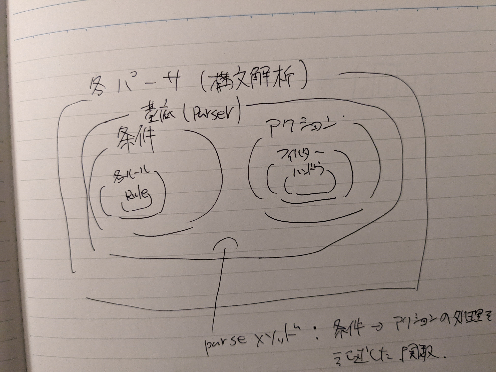

# テキストからHTMLへの変換

## 課題
プレンテキストに書式を付与したい。
（プレーンテキスト→HTML）
条件：
1. 入力は内容に関係ないコードやタグが埋め込まれている必要はないものとする。
1. 見出し、段落、リスト項目、インラインのテキストなど各種のブロックを処理できるようにする。
1. 今回の実装ではHTMLを扱うが、他のマーク合アップ言語に容易に拡張できるようにする。

## 役に立つツール
- ファイルの読み書き、または少なくとも標準入力(sys.stdin)からの読み込みとprintによって出力
- 入力を１行ごとに反復する
- 数種の文字列関連メソッド
- ジェネレータをいくつか作成
- reモジュール
## 準備
- test_input.txtを作成

## 最初の実装
1. バラグラフ(テキストブロック)の分割（空行で判断）
1. マークアップの付与
## 二回目の実装
プログラムをよりモジュール化していく

抽象かできる部品
- パーサ（構文解析）
  - 条件：ルールに一致している判断するモノ。ルールで実装したものを使う。
  - アクション：条件を満たしたモノへの処理。ハンドラで実装したモノを使う
- ルール（パーサーの条件の部分）
  - 見出しとは、一行のみからなる、最長７０文字のブロックで、最後が「：」「.」「。」でないもの
  - タイトルとは、文書の最初のブロックでかつ見出しであるもの
  - リスト項目とは、「-」で始まるブロック
  - リストは、リスト項目でないブロックとそれに続くリスト項目の間で始まり、リスト項目とそれに続くリストでないブロックの間で終わる。

- フィルタ(一定の条件に基づいてデータなどを選別・加工・排除する装置や機能、仕組みなどを指す)
  - re.subを使って、条件を満たした文字列を置き換える（加工）する装置。re.subの引数の置き換える文字ににhandlerのアクションを使う
- ハンドラ（何らかの処理要求が発生したときに起動されるものを指すことが多い）
  - callbackメソッド：サブクラスで呼び出せるか確認（接尾辞と名前の組み合わせで）と呼び出せる場合は呼び出す。
  - startメソッド：受け取ったname(マークアップの種類などの名前)に接頭辞でstartをつけて、callbackを呼び出す
  - endメソッド：startの接頭辞がend版
  - subメソッド：上記の二つの接頭辞がsub版。関数を返す。 \
  上記の４つのメソッドを持ったスーパークラスを作成。サブクラスにアクションを追加していく。
## さらに試したいこと
- 表に対応する。すべての整列しているごの左側の境目を見つけて、そのブロックを列に分割する。
- 大文字の単語すべてを強調と解釈する機能をつける（頭文字、句読記号、名前、その他の大文字語を考慮する必要がある）
- LaTexで出力できるようにする
- マークアップ以外のことをするハンドラを記述する。例えば、文書から何らかの方法で分析するハンドラなど
- ディレクトリ内の全てのテキストファイルをHTMLファイルに自動変換するスクリプトを作成する
- 既存のプレンテキストについて検討する

メモしておきたいと思ったモノだけをまとめた。この理解で本当にあっているのかは自身はない。